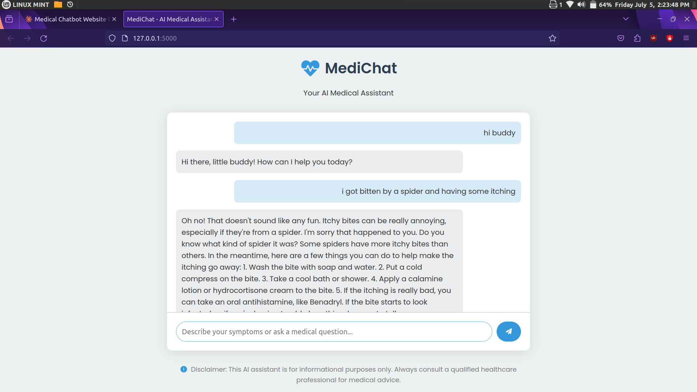

# Gemini_bot

# Gemini AI Chatbot

This repository contains the code for a Gemini-based AI chatbot using Flask for the web interface. The project structure is organized to separate the backend logic, frontend assets, and configuration files for deployment on Vercel.

### Welcome Page



## Table of Contents

- [Project Structure](#project-structure)
- [Installation](#installation)
- [Usage](#usage)
- [Contributing](#contributing)


## Project Structure

```
├── index.py
├── requirements.txt
├── server.py
├── static
│   ├── script.js
│   └── styles.css
├── templates
│   └── index.html
├── vercel.json
└── wsgi.py
```

- `index.py`: Entry point for the chatbot application.
- `requirements.txt`: Contains the list of dependencies required for the project.
- `server.py`: Flask application setup and route definitions.
- `static`: Directory for static files (JavaScript and CSS).
  - `script.js`: JavaScript file for client-side interactions.
  - `styles.css`: CSS file for styling the web interface.
- `templates`: Directory for HTML templates.
  - `index.html`: Main HTML template for the web interface.
- `vercel.json`: Configuration file for deploying the application on Vercel.
- `wsgi.py`: WSGI entry point for the application.

## Installation

1. Clone the repository:
   ```sh
   git clone https://github.com/your-username/gemini-ai-chatbot.git
   cd gemini-ai-chatbot
   ```

2. Create a virtual environment and activate it:
   ```sh
   python3 -m venv venv
   source venv/bin/activate
   ```

3. Install the required dependencies:
   ```sh
   pip install -r requirements.txt
   ```

## Usage

1. Run the Flask application:
   ```sh
   python server.py
   ```

2. Open your web browser and navigate to `http://127.0.0.1:5000` to interact with the chatbot.


## Contributing

Contributions are welcome! Please follow these steps:

1. Fork the repository.
2. Create a new branch:
   ```sh
   git checkout -b feature-branch
   ```
3. Make your changes and commit them:
   ```sh
   git commit -m "Description of changes"
   ```
4. Push to the branch:
   ```sh
   git push origin feature-branch
   ```
5. Create a pull request

Currently on going work to deploy it.
